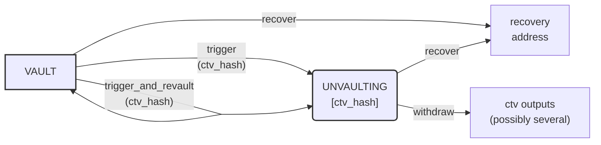

# Designing contracts

MATT enables on-chain protocols in Bitcoin's UTXO model using covenant encumbrances. The UTXOs themselves carry the **state** of the contract, and state transitions happen by spending UTXOs and producing new ones -- with rules encoded in the UTXO itself.

This page documents the framework used across all the examples in this repository.

See [BIP-443](https://github.com/bitcoin/bips/blob/master/bip-0443.mediawiki) for the semantics of `OP_CHECKCONTRACTVERIFY`

## Contracts, programs, and clauses

The combination of a naked internal pubkey and a taptree constitutes the **program** of a contract. It encodes every possible spending condition.

Thanks to the semantics of `OP_CHECKCONTRACTVERIFY`, we can consider UTXOs as being *augmented* with some data, in the sense that they contain a cryptographic commitment to it.

All contracts in this framework can be thought as _augmented_ P2TR contracts. For stateless contracts, the embedded data is simply empty (`b""`), which leaves the internal pubkey unchanged.

A concrete UTXO whose `scriptPubKey` matches a program -- possibly with specified embedded data -- is a **contract instance**.

Each spending condition in the taptree is called a **clause**. A clause may also define state-transition rules by specifying the program and data of one or more outputs. The keypath spend (when the internal key is not a NUMS point) acts as an additional implicit clause with no covenant constraints on outputs.

## Merkleized data

While the embedded data slot is a single 32-byte value, it can represent arbitrarily complex state through commitments:

| State shape | Encoding |
|-------------|----------|
| Single 32-byte value | Stored directly |
| Single value of other size | SHA256 hash |
| Multiple values | Merkle tree root of the individual (hashed) values |

> **Note**: Other commitment schemes are possible. For example, hashing the concatenation of individual hashes is more efficient when all values must be revealed anyway. Care is needed -- not all hash-concatenation schemes are collision-resistant.

## Smart contracts as finite state machines

Because clauses can constrain the program and data of their outputs, UTXO-based protocols naturally form **finite state machines**: each node is a contract, and its clauses define transitions to other contracts.

For many protocols, spending a UTXO produces one or more pre-determined contracts as outputs, making the resulting diagram a **directed acyclic graph** (DAG). Some contracts may produce an output with the _same_ contract as the input -- creating a self-loop -- but cross-contract loops are impossible because they would require hash cycles.

Here is the state machine for the [vault](../examples/vault/) contract:



> **Note**: This diagram represents a _single UTXO's_ possible states and transitions. Some protocols span multiple UTXOs that interact through shared transaction inputs.

## Notation

We represent a contract as:

```
ContractName{params}[vars]
```

where:
- **ContractName** (CamelCase) is the contract's name
- **params** are compile-time parameters, hardcoded in the Script
- **vars** are state variables, stored in the UTXO's data commitment

Both `params` and `vars` are omitted when empty. Global parameters (shared across all contracts in a protocol) are listed separately for brevity.

### Terminology

| Term | Meaning |
|------|---------|
| _Parameters_ | Fixed at contract creation time, baked into the Script |
| _Variables_ | State stored in the UTXO, accessible via `OP_CHECKCONTRACTVERIFY` |
| _Arguments_ | Passed by the spender in the witness at spend time |

### Clause transitions

A clause that produces a single output:

```
clause_name(args) => out_i: Contract{params}[vars]
```

A clause that produces multiple outputs:

```
clause_name(args) => [
    out1_i: Contract1{params1}[vars1],
    out2_i: Contract2{params2}[vars2]
]
```

`out_i` is the index of the output that must match the contract. When omitted (allowed for at most one output), it defaults to the current input's index.

The destination contract's `params` can only depend on the current contract's `params`. The destination `vars` can depend on `params`, `vars`, and the clause's `args`.

A clause with no `=>` output specification has no covenant constraints -- it is an unconditional spend.

## Example: Vault

Using the notation above, we can model the vault's state machine:

```
global unvault_pk    -- public key that can trigger a withdrawal
global recover_pk    -- public key for the recovery address
global spend_delay   -- blocks to wait before final withdrawal


Vault:
  trigger(ctv_hash, out_i) => [out_i: Unvaulting[ctv_hash]]:
    checksig(unvault_pk)

  trigger_and_revault(ctv_hash, revault_out_i, trigger_out_i) => [
    deduct revault_out_i: Vault,
    trigger_out_i: Unvaulting[ctv_hash]
  ]:
    checksig(unvault_pk)

  recover => P2TR{recover_pk}:
    pass


Unvaulting[ctv_hash]:
  withdraw:
    older(spend_delay)
    ctv(ctv_hash)

  recover => P2TR{recover_pk}:
    pass
```

A matching Rust implementation can be found in [`examples/vault/src/lib.rs`](../examples/vault/src/lib.rs).
