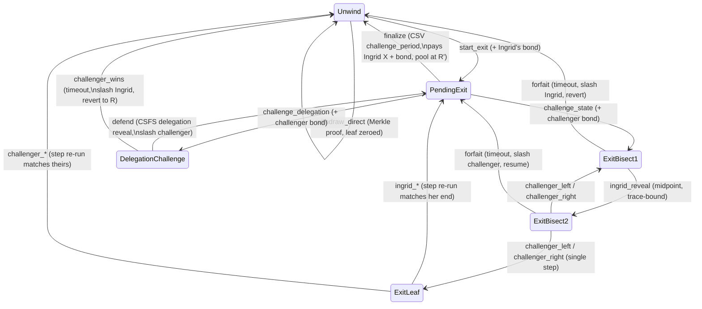

# Aggregate exits: contract specification

The concrete contracts implementing the protocol sketched in
[`aggregate_exits.md`](aggregate_exits.md): unilateral exits from a pooled
UTXO, where users too small to exit alone delegate to an intermediary
("Ingrid") who withdraws their aggregate balance optimistically — bonded,
challenge-gated, and backed by two kinds of fraud proof.

Script requirements: standard opcodes plus `OP_CAT`,
`OP_CHECKCONTRACTVERIFY` (CCV) and `OP_CHECKSIGFROMSTACK` (CSFS, BIP 348,
`0xcc`). Exact output *amounts* cannot be introspected today; every such check
is marked `TODO(OP_AMOUNT)` in the code and listed in the
[amount table](#amounts-and-the-op_amount-gaps) below.

## Data model

- **Pool parameters** (`PoolParams`, shared by every contract in the chain):
  `pool_id` (32 bytes, domain-separates delegations), `n_users` (any size,
  fixed at creation; the trees are padded with NIL leaves to the next power of
  two `N`, depth `D = log2 N`), `challenge_period` and `response_timeout`
  (CSV blocks), `bond` (sats, documentation until OP_AMOUNT).
- **Account tree**: leaf `u` is `sha256(pk_u || bn2vch(balance_u))`, or
  `NIL = 0x00…00` for withdrawn/padding slots. The pool commits only the root.
- **Exit set S**: one bit per slot, committed as a parallel N-leaf tree with
  leaf `sha256(bn2vch(bit))`. The bits themselves are *published* in the
  `start_exit` witness and bound to `s_root` in-script (O(N) hashing at claim
  time), so any observer can recompute the honest claim — without data
  availability of S, fraud would be unchallengeable.
- **Step commitment**: the claimed run is an N-step computation over the state
  `(root, sum)`, committed per step as `h = sha256(root || bn2vch(sum))`
  (`h_0 = sha256(R)` since `bn2vch(0)` is empty). Step `u`: if `bit_u` is set,
  zero leaf `u` and add its balance to `sum` (a set bit on a NIL slot changes
  nothing).
- **Trace**: `mattrs::fraud::trace` over `h_0 … h_N` — the standard bisection
  commitment `t[i,j] = sha256(h_i || h_{j+1} [|| t_left || t_right])`.
- **Delegation**: the user BIP340-signs `sha256(pool_id || ingrid_pk)`;
  verified in-script with CSFS against the user's in-pool key.

## Contract state machine

Committed state per contract (all augmented-P2TR state tweaks; `#[commit(merkle)]`
over the listed leaves, in order):

| Contract | Committed leaves |
|---|---|
| `Unwind` | `root` (identity, 32 B) |
| `PendingExit` | `unwind_taptree, r, r', s_root, ingrid_pk, trace_i, sha256(bn2vch(x))` |
| `DelegationChallenge` | `resume_hash, pe_taptree, unwind_taptree, r, ingrid_pk, user_pk, challenger_pk` |
| `ExitBisect1{i,j}` | `h_start, h_end_i, h_end_c, trace_i, trace_c, carry` |
| `ExitBisect2{i,j}` | the above + `h_mid_i, t_left_i, t_right_i` |
| `ExitLeaf{k}` | `h_start, h_end_i, h_end_c, carry` |

`carry = sha256(ingrid_pk || challenger_pk || s_root || r || resume_hash ||
pe_taptree || unwind_taptree)` — everything a settlement needs, packed into one
leaf and re-expanded from the witness by the clauses that use it.

### Breaking the taptree cycle

`Unwind.start_exit` references `PendingExit`'s taptree, whose challenge clauses
reference the dispute contracts, whose settlement clauses re-enter `PendingExit`
and `Unwind` — a hash cycle if those back-references were script constants. A
script cannot contain its own hash, but it *can verify a witness-supplied copy
of it*: CCV in check-input mode takes the taptree as a stack argument, so
`start_exit` binds `unwind_taptree` (and the challenge clauses bind
`pe_taptree`) against the very input being spent, then commits it forward as
state/carry data. The dispute chain's own forward references
(`ExitBisect1{i,j} → ExitBisect2{i,j} → ExitBisect1{halves} | ExitLeaf{k}`)
are acyclic and stay params-derived script constants.

### Dynamic parties, no signatures

Ingrid and the challengers appear long after the pool's creation, so — unlike
the two-party `mattrs::fraud` module, whose keys are params — their keys live
in *committed state*, and the scripts are party-independent. No pool-chain
clause checks a sighash signature at all:

- every reveal is data-bound to a previously committed trace, so it cannot be
  forged (only mistimed, which the forfait deadlines govern);
- every output is covenant-fixed, so it does not matter who broadcasts;
- the *only* signatures are bond owners spending their own UTXOs
  (`ExitBond`, plain `OP_CHECKSIG`) and the off-chain delegation signatures
  (CSFS).

Documented consequence: until OP_AMOUNT exists, the deduct-amount outputs are
chosen by the broadcaster, and a challenge transaction could in principle be
front-run with a swapped reward key. Neither breaks the protocol's safety goal
(a fraudulent claim still fails; the pool funds still return to the covenant).

## Clauses

### `Unwind` — the pool
- **`withdraw_direct(pk, bal, proof, root)`**: dual leaf→root walk recomputes
  the current root (membership) and the root with the leaf zeroed, in lockstep
  (the RAM `write` pattern). Outputs: `[0]` deduct → `P2TR(pk)` 💰, `[1]`
  preserve → `Unwind{root'}`.
- **`start_exit(unwind_taptree, root, r', bits×N, ingrid_pk, trace_i, x)`**:
  binds `unwind_taptree` via check-input CCV; hashes the published bits into
  `s_root`; commits the seven `PendingExit` leaves. Output: `[0]` preserve →
  `PendingExit` 💰 (Ingrid's bond joins via a batched `ExitBond.stake_claim`
  input; the manager merges the two preserve outputs).

### `PendingExit` — the claim
- **`finalize`** ⏱`challenge_period`: `[0]` deduct → `P2TR(ingrid_pk)` 💰
  (`x + bond`), `[1]` preserve → `Unwind{r'}`.
- **`challenge_state(…, pe_taptree, challenger_pk, h_end_c, trace_c)`**:
  binds `pe_taptree`; computes `h_start = sha256(r)`,
  `h_end_i = sha256(r' || bn2vch(x))`, the carry, and enters
  `ExitBisect1{0, N-1}` 💰 (challenger bond batched in).
- **`challenge_delegation(…, pe_taptree, challenger_pk, user_pk, bal, dual proof)`**:
  one shared-direction walk proves slot `k` holds `(user_pk, bal)` in `r`
  *and* its exit bit is set in `s_root`; enters `DelegationChallenge` 💰.
  Permissionless: a third party disputing a delegation that exists just loses
  its bond to Ingrid's `defend`.

### `DelegationChallenge`
- **`defend(sig)`**: `sig` verifies over `sha256(pool_id || ingrid_pk)` against
  `user_pk` via CSFS. `[0]` deduct → Ingrid 💰(`bond/2`), `[1]` deduct → burn
  💰(`bond − bond/2`), `[2]` preserve → `PendingExit{resume}` (fresh challenge
  period — each spurious retry costs another half-bond).
- **`challenger_wins`** ⏱`response_timeout`: `[0]` deduct → challenger
  💰(`bond + bond/2`), `[1]` deduct → burn 💰, `[2]` preserve → `Unwind{r}`.

### `ExitBisect1{i,j}` / `ExitBisect2{i,j}` — the bisection game
Same turn structure as `mattrs::fraud`: Ingrid reveals her midpoint and half
traces (checked against `trace_i`), the challenger reveals theirs and recurses
into the *left* half if the midpoints differ, the *right* half if they agree —
an `ExitLeaf{k}` once the half is a single step. Each turn has a `forfait`
clause: stalling loses (settlements as in `DelegationChallenge`, with the roles
matched to who stalled).

### `ExitLeaf{k}` — the disputed step, re-run on-chain
Slot `k`'s Merkle directions are script constants. Three cases × two winners
(one straight-line script each):
- **noop**: prove `bit_k = 0`; the honest end is `h_start` itself.
- **nil**: reveal `(root_k, sum_k)` (the preimage of the *agreed* `h_start`);
  prove `bit_k = 1` and leaf `k` = NIL in `root_k`; the end is `h_start`.
- **spend**: additionally reveal `(pk_u, bal)`; walk the leaf and its NIL
  replacement up the same siblings for `root_{k+1}`; `sum_{k+1} = sum + bal`
  (32-bit `OP_ADD`; real amounts need 64-bit arithmetic, a known gap); the end
  is `sha256(root_{k+1} || bn2vch(sum_{k+1}))`.

Whichever party's committed ending equals the recomputed one wins; settlement
as in the forfaits. If *both* committed false traces, no clause is satisfiable
and the pot is stuck — a mutual-griefing corner inherited from the generic
module (both bonds are already forfeit at that point).

### `ExitBond`
A plain owner-signed UTXO with one clause per pot it can join (`stake_claim`,
`stake_state_challenge`, `stake_delegation_challenge`). Its witness carries the
target's state fields only so its `next()` reproduces the pool-side clause
output exactly; `ContractManager::spend_batch` then merges the two preserve
outputs into one accumulated pot.

## Amounts and the OP_AMOUNT gaps

Every row below is enforceable only with an output-amount introspection opcode
(e.g. `OP_AMOUNT`); today the demo sets them honestly via
`SpendBuilder::output_amount` and the code marks each with `TODO(OP_AMOUNT)`.

| Transition | Output | Intended amount |
|---|---|---|
| `withdraw_direct` | 0 (user) | `balance_u` |
| `start_exit` | 0 (PendingExit) | pool + `bond` |
| `finalize` | 0 (Ingrid) | `x + bond` |
| `challenge_*` | 0 (dispute) | pot + `bond` |
| loser = challenger | 0 (Ingrid) / 1 (burn) | `bond/2` / `bond − bond/2` |
| loser = Ingrid | 0 (challenger) / 1 (burn) | `bond + bond/2` / `bond − bond/2` |

Burns pay the NUMS key verbatim as the taproot output key (no known discrete
log, no script path): provably unspendable.

## Deviations from the blueprint

- **No delegations root (`D_root`)**: with CSFS, Ingrid defends by revealing
  the delegation signature directly; an upfront Merkle commitment of the
  delegations adds nothing to soundness. (The blueprint's `D_root` mainly
  served the no-CSFS workaround.)
- **The exit set is a bitmap, not an index list** — the blueprint's own
  "1 bit per user" refinement — published in the claim witness and committed
  as a bit tree so single bits are provable by Merkle proof.
- **Single-UTXO game**: challenges spend the claim itself (the blueprint's
  "parallel withdrawals" idea is an open problem there too); a failed fraud
  proof resumes the claim with a fresh challenge period, so other users can
  still challenge — each attempt costs its challenger half a bond.
- **Fully permissionless clauses** (see above); the blueprint's per-party
  authorizations are replaced by data-binding plus covenant-fixed outputs.

## Files

- `contracts/` — the contracts (`unwind`, `pending_exit`, `delegation`,
  `dispute`, `bond`), the pool/claim model (`mod.rs`), and a symbolic
  stack-tracking script assembler (`stack.rs`).
- `main.rs` — the regtest demo, one scenario per execution path.
- `../../tests/test_aggregate_exits.rs` — offline unit/build/protocol tiers
  plus `#[ignore]`d regtest e2e.
